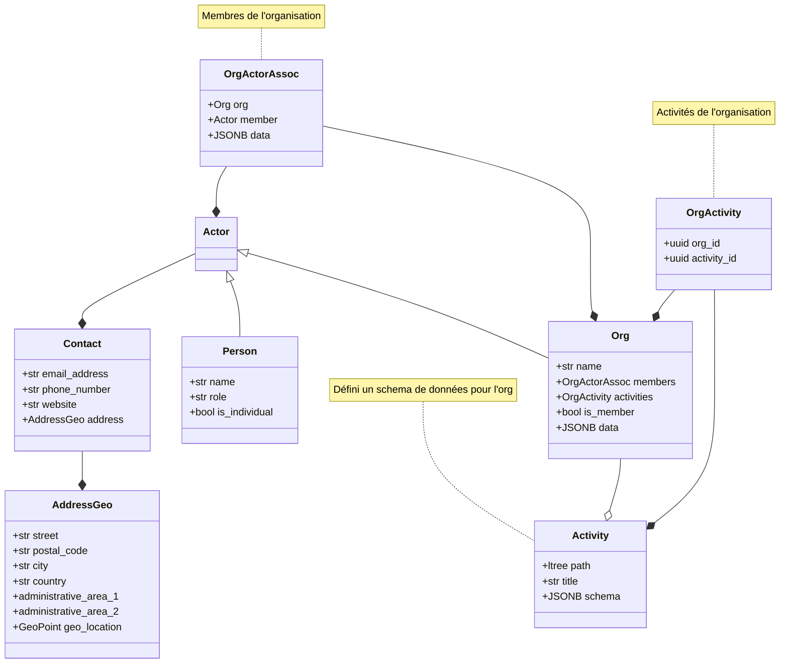
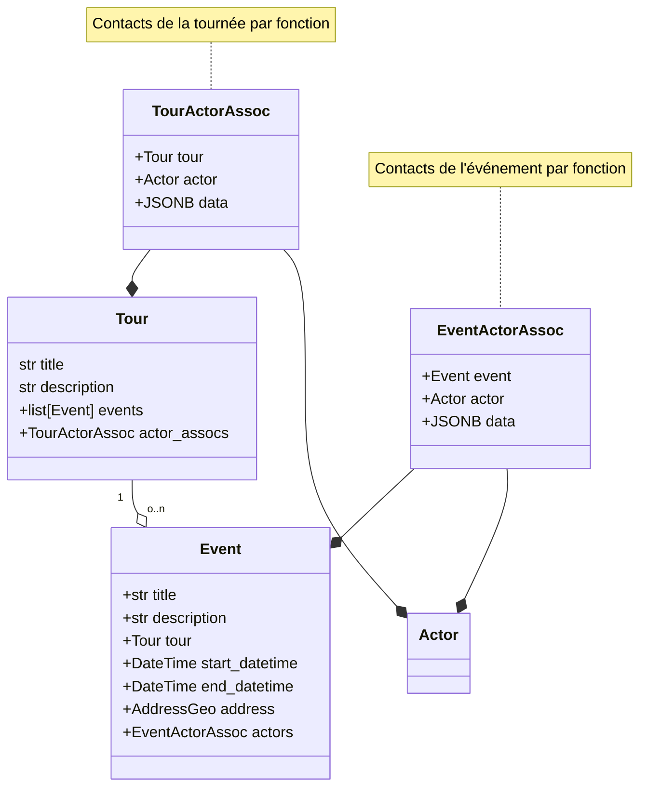
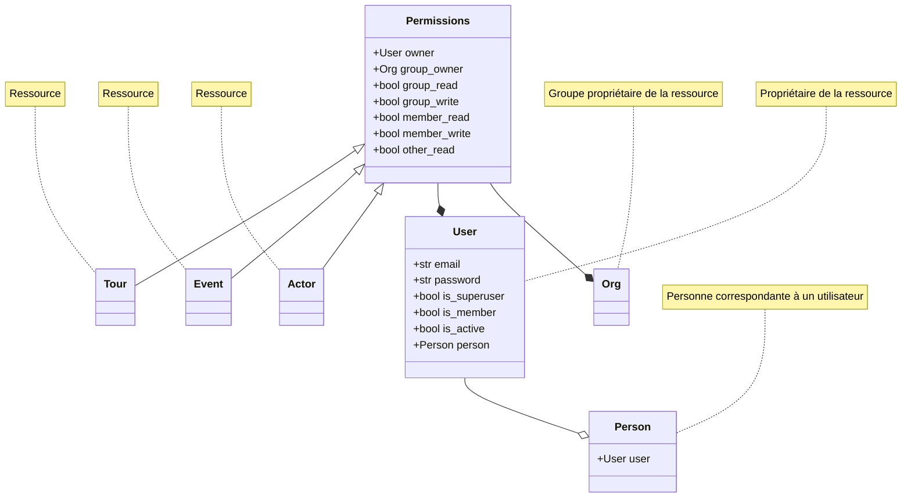

# Modèles backend

## Annuaire

### Fiche Personne

Une fiche Personne représente une personne de la vie réelle avec bio, contact, fonction, etc.
à l'opposé d'une personne morale qui sera enregistrée en tant qu'organisation.

### Fiche Organisation

Une fiche Organisation représente un organisation réelle ou virtuelle. C'est un conteneur pour y attacher :

- une liste des activités de l'organisation (fiche Activité) et ainsi des informations supplémentaires liées à ces activités ;
- une liste de ses membres (fiches Personne et Organisation) ;
- des informations de contact.

Le **type** d'une organisation :

- externe : l'organisation n'est pas liée à l'éditeur ;
- interne : l'organisation est liée à l'éditeur, ses membres ont des privilèges supplémentaires. Exemple : Armodo et Slowfest.

### Fiche Activité

Une fiche Activité permet de décrire l'activité d'une organisation. Cela comprend :

- un nom et une description ;
- une liste des rôles possibles décrivant la ou les relations entre un membre et une organisation ;
- une liste des informations supplémentaires à lier à une Organisation.

	exemple: une organisation qui a comme activité "Restauration" ajoutera des champs sur la fiche de l'organisation pour savoir si c'est végétarien ou non.

## Tournée

Pour partager mon plan de tounée, j'ai besoin de :

- des lieux où je vais passer
- des événements ou je vais passer

Je vais saisir des étapes pour ma tournée

- un lieu (une organisation ?)
- une date
- une description

Si c'est je passe dans une salle de concert puis à un festival en 2 étapes :

- je créé ou sélectionne les 2 organisations

### Fiche Tournée

- propriétaire : utilisateur, donc une personne, et une organisation
- permissions : organisation / membres / autres
- acteurs avec role
- liste d'event

### Fiche Événement

- propriétaire : utilisateur, donc une personne, et une organisation
- permissions : organisation / membres / autres
- acteurs avec role
- lieu
- date debut
- date fin

## Permissions

### Présentation

Le système de permissions concerne les acteurs, tournées et événements. Cela permet de définir
qui peut lire ou modifier ces entités.

Ces entités ont chacune :

- un propriétaire : un utilisateur ;
- et un groupe propriétaire : une organisation.

Les permissions sont définies pour :

- les utilisateurs membres d'Armodo (User.is_member) en lecture/écriture
- les membres du groupe propriétaire en lecture/écriture
- les autres (utilisateur non membre et utilisateur non connecté)

#### Utilisateur

Un utilisateur est une personne qui a un compte sur le système, avec email et mot de passe.

Les **rôles** que peut exercer un utilisateur :

- superadmin : il peut faire tout ce qu'il est possible de faire ;
- membre : il est membre d'armodo

Les **statuts** d'un utilisateur :

- actif : il peut se connecter ;
- inactif : il ne peut pas se connecter (suite à la création d'un compte en attente de modération par exemple).

Un utilisateur peut être relié à une personne, elle même reliée à une organisation, permettant ainsi
de déduire les permissions liées au groupe propriétaire d'une entité.

#### Mise à jour des permissions

Seul le propriétaire d'une entité peut modifier son propriétaire et son groupe propriétaire.

### Diagramme

